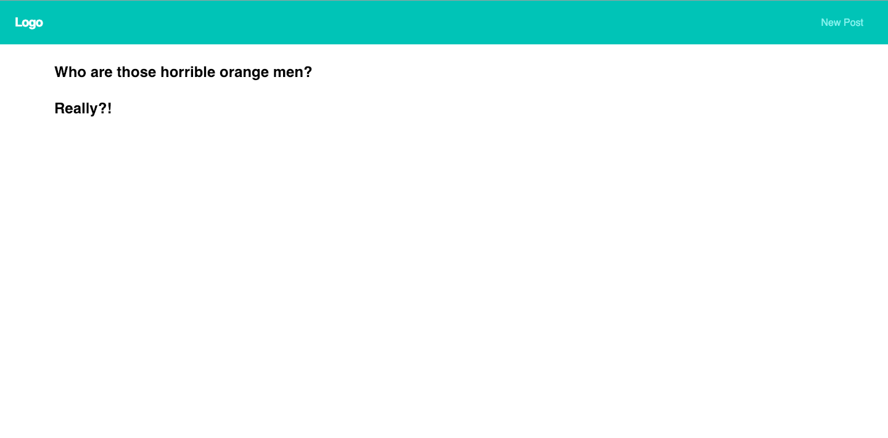

# Simple MERN Application

This is the codebase for a MERN application to go with the blog post located [here](https://www.iamtimsmith.com/blog/what-is-the-mern-stack-and-how-does-it-work/). It is not intended to be a complicated or production ready application, but rather to explain in easy-to-understand terms how the different pieces of the MERN stack fit together.



To Download:

```
git clone https://github.com/iamtimsmith/simple-mern-app.git
```

Then:

```
npm install

or

yarn
```

To run the server only:

```
npm run server

or

yarn server
```

To run the client only:

```
npm run client

or

yarn client
```

To run both together:

```
npm run dev

or

yarn dev
```
